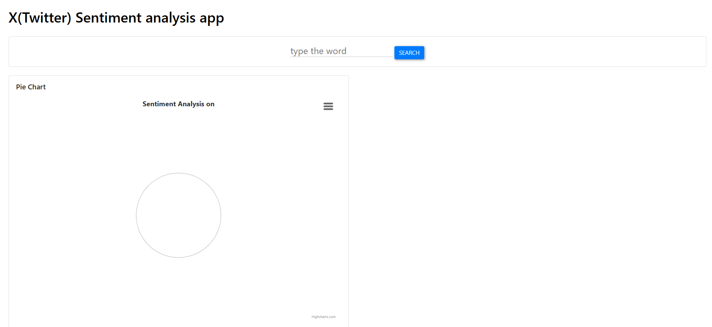
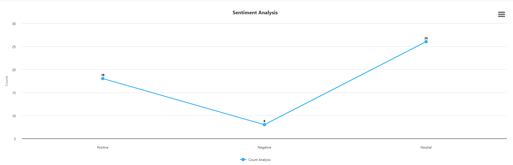
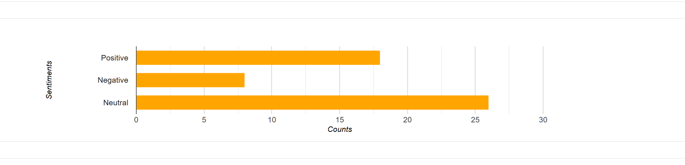

# 🧠 Twitter Sentiment Analysis Project

## 🎯 Project Aim

The aim of this project is to perform real-time sentiment analysis on Twitter data to gauge users' emotional tone and opinions toward a specific topic. It uses modern web technologies and NLP tools to deliver an interactive and educational experience.

---

## 🌍 Why Twitter?

Twitter provides an abundance of real-time, public data, making it an excellent platform to:

 - Understand public opinion on trending topics

 - Track reactions during events or campaigns

 - Analyze consumer sentiment around products or brands

---
## 🧰 Tech Stack

| Layer         | Tools Used                                       |
|---------------|--------------------------------------------------|
| **Backend**   | Python, Flask, Tweepy (API v2), TextBlob         |
| **NLP**       | TextBlob (built on top of NLTK)                  |
| **Frontend**  | HTML5, CSS3, JavaScript, Chart.js                |
| **Security**  | `.env`, `python-dotenv` for API key management   |
| **Deployment**| Gunicorn (WSGI), Procfile                        |

---
## 📥 1. Data Collection

 - Tweets are collected using Twitter API v2 based on keywords or hashtags
 - The app uses App-only authentication (Bearer Token) for simplicity
 - Each tweet includes metadata like:
    - Tweet text
    - Timestamp
    - Retweet count
    - Language

🔐 Note: Due to free-tier limitations, only tweets from the past 7 days are available and rate limits apply.

---

## 🧹 2. Data Preprocessing

Before analysis, tweets undergo **cleaning and normalization**:
- ❌ Remove:
  - URLs
  - Usernames (@mentions)
  - Hashtags (#topic)
  - Special characters and emojis
- 🧽 Clean text by:
  - Lowercasing
  - Tokenization
  - Removing stop words
  - Stemming or lemmatization
This step ensures the text is standardized for machine learning.

---

## 🧠 3. Sentiment Classification

We analyze the sentiment using **NLP** and **machine learning**. Techniques include:

### 🛠 Approaches:
- **Rule-based** or **lexicon-based** methods (e.g., TextBlob, VADER)
- **Machine Learning Models**:
  - Naive Bayes
  - Support Vector Machines (SVM)
  - Logistic Regression
  - (Optional) Deep Learning models like RNNs

---

## 🧪 4. Model Training

- A **labeled dataset** is used for training, where each tweet has a known sentiment.
- The model learns the relationships between words and sentiment classes.
- Public datasets (like Sentiment140 or Kaggle datasets) or manually labeled tweets are used.

---

## 🧾 5. Sentiment Prediction

Once trained, the model is applied to the collected Twitter data to classify each tweet as:
- ✅ **Positive**
- ❌ **Negative**
- ➖ **Neutral**

Each tweet receives a sentiment label that reflects its emotional tone.

---

## 📊 6. Analysis & Visualization

We extract insights from the predicted data using:
- 📈 **Sentiment distribution charts**
- ☁️ **Word clouds** for each sentiment class
- 🕒 **Time series analysis** (if tracking over time)

These visual tools help highlight key trends and patterns in public sentiment.
## 📷 Dashboard Visuals
 - Pie Chat

 - Line Chat

 - Bar Chat
 

---
## ⚠️ API Limitations

| Limitation                          | Details                                                                 |
|-------------------------------------|-------------------------------------------------------------------------|
| 🔐 **Free Tier (Essential Access)** | Only supports **recent tweets** (past 7 days), 450 requests/15 min      |
| 💰 **Full Access Requires Payment** | Historical search, volume access, and full archive require paid tiers   |
| ⛔ **Rate Limits**                  | 429 error if you exceed limits — app handles this gracefully            |
| 🔗 **No user authentication**       | This app uses **App-only authentication** (suitable for public search)  

---

## 🎯 Use Cases

- 📢 **Marketing**: Understand customer feedback on products or campaigns  
- 🗳️ **Politics**: Track public opinion during elections or debates  
- 💼 **Business**: Monitor brand perception  
- 📈 **Research**: Study social behavior and mood across different topics  

---
## 💪 Setup Instructions
Clone the repo and install dependencies

 - git clone https://github.com/Takunda-Madondo/X-Twitter-_Sentiment_Analysis
 - cd X-Twitter-_Sentiment_Analysis
 - python -m venv venv
 - source venv/bin/activate  # or venv\Scripts\activate on Windows
 - pip install -r requirements.txt
 - Create a .env file in the root directory:
 - TWITTER_BEARER_TOKEN=your_bearer_token_here

Run the application
 - python app.py
 - Visit: http://localhost:5000

---
## 🚀 Deployment

This app is ready for deployment on platforms like Heroku or Render. A simple Procfile is included:

 - web: gunicorn app:app

## ✅ Conclusion
This project demonstrates how sentiment analysis on Twitter can uncover valuable insights into public opinion by:
 - Leveraging real-time data from Twitter
 - Applying NLP using Python and TextBlob
 - Presenting insights visually with a web-based dashboard

It showcases the synergy of data engineering + sentiment analysis + web development.

---
